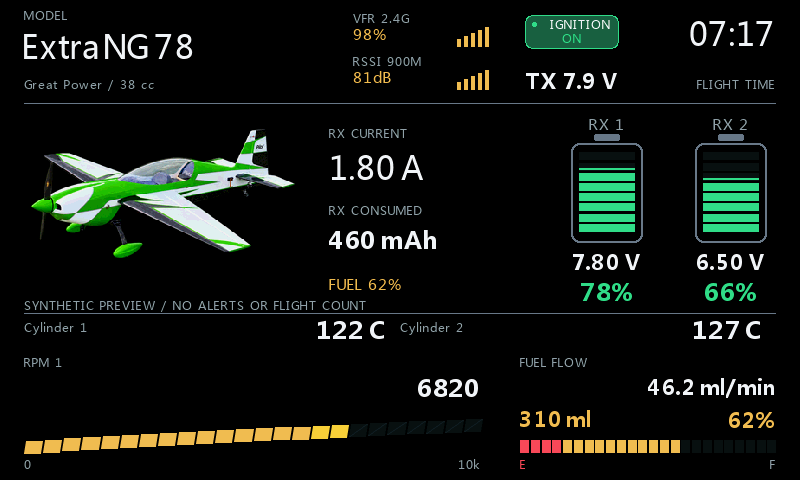
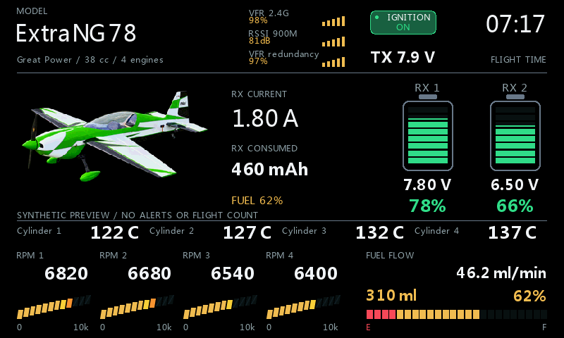
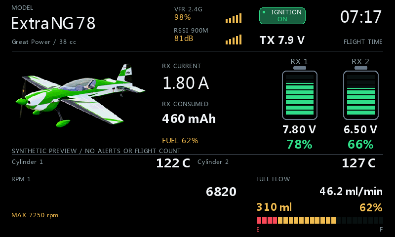
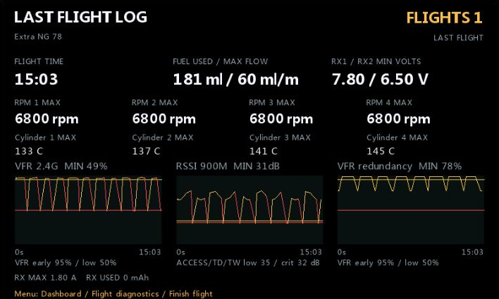
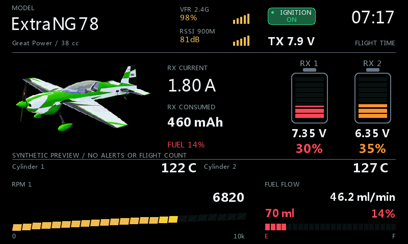
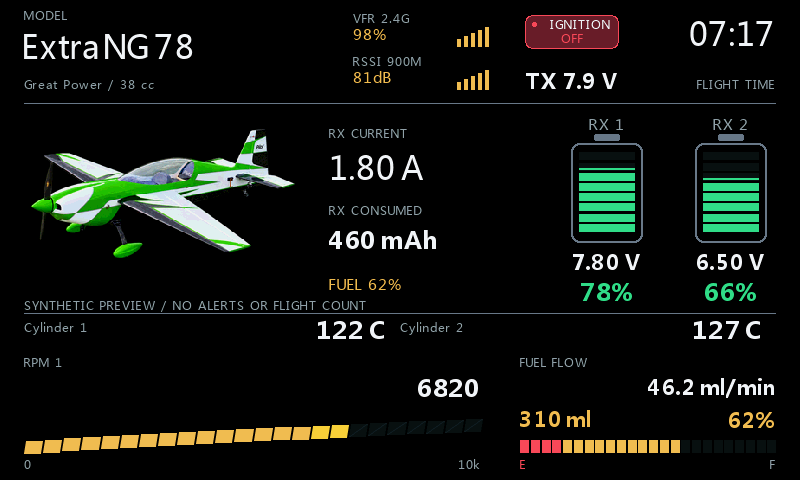

# GasDeck

A full-screen receiver-power, gasoline-engine and fuel dashboard for FrSky ETHOS 1.6.6 and 26.1.2.

**GasDeck 2026.10-v5: latest release. Physical radio testing passed.**

[Download GasDeck-2026.10-v5.zip](https://github.com/bliatun-code/GasDeck/releases/download/gasdeck-2026.10-v5/GasDeck-2026.10-v5.zip) | [Release notes](https://github.com/bliatun-code/GasDeck/releases/tag/gasdeck-2026.10-v5)

The screenshots use illustrative values and example layouts.

[Illustrated configuration guide](docs/Configuration.md) |
[Norsk veiledning](docs/Konfigurasjon-norsk.md) |
[Installation and usage](docs/GasDeck.md) |
[Lua source](scripts/GasDeck/main.lua)

## Choose your engine deck

<table>
<tr><td> <b>One engine</b> Retro LCD RPM, flow and tank reserve.</td><td> <b>Four temperatures</b> Independently chosen measurement points.</td></tr>
<tr><td> <b>Four engines</b> Up to four RPM and four temperatures.</td><td> <b>Numeric RPM</b> Measured speed and session peak.</td></tr>
<tr><td> <b>Flight summary</b> Peaks, fuel use and RF signal history.</td><td> <b>Reserve and alerts</b> Fuel reserve and separate RX capacity.</td></tr>
</table>

## Highlights

- Active model name and optional reuse of its selected model picture.
- Receiver battery readings and transmitter voltage.
- Two independently configured LiPo/LiFe RX batteries; individual mAh, percent or explicit voltage estimate.
- Combined RX current and consumption.
- Independently selectable 0-4 measured RPM and 0-4 temperatures, LCD or numeric RPM.
- Flow in ml/min; tank from consumed volume, integrated flow, remaining volume or percent.
- Configurable reserve, separate low-fuel/RX WAV files and a repeat interval.
- Ignition ON/OFF/unknown; source-named RSSI/VFR and 1-3 actual RF sources.
- Per-model counter, retained last flight and optional delayed automatic log opening.
- Radio theme, black or custom background, with your selected model picture.

## Install GasDeck

1. Download [GasDeck-2026.10-v5.zip](https://github.com/bliatun-code/GasDeck/releases/download/gasdeck-2026.10-v5/GasDeck-2026.10-v5.zip) from the release assets, not GitHub's automatic source archive.
2. Extract `scripts/GasDeck` onto the radio SD card; the final path is `scripts/GasDeck/main.lua`.
3. Remove any existing `scripts/GasDeck/main.luac`, restart ETHOS and select **GasDeck** in a full-screen widget area.
4. Follow the [TD SR18 / AES II walkthrough](docs/Configuration.md) or [norsk veiledning](docs/Konfigurasjon-norsk.md) to select sources in menu order. Turn **Synthetic preview** off for live operation.

The ZIP includes installation instructions, license and notices. Keep a backup
of your model and widget settings when updating.

## Ignition and sorties

ON is green, OFF red and unavailable status neutral with `--`. A switch reports
a command, not proof of ignition power or a running engine. GasDeck never controls
the aircraft.

Enable logging, select throttle and ignition. Defaults: 60 s qualifying time including
5 s above 50% normalized throttle. Ignition OFF/unknown pauses the same session;
ON again does not count a second flight. Blank airborne gate is optional.

Gasoline sorties often retain receiver batteries. Between sorties, use **Finish flight**
with valid ignition OFF, or confirm an actual **Refuel**. Refuel also works with the
model off or ignition ON; a qualified active flight blocks it. Loss of both RX feeds for
**Power loss delay** also ends the session; RF failure can resemble disconnected power.
The last qualified log remains until a new flight qualifies. Only the counter survives
radio restart; graphs/summary stay in RAM. Automatic log opening defaults Off.

## Safety and compatibility

Keep native alarms, failsafe, pre-flight checks and physical ignition safety
enabled. Check sources and settings on your own model when using other radio
or firmware combinations.

## License

GasDeck is available under [MIT](LICENSE). The example artwork has separate
terms described in [NOTICE](NOTICE.md).

## Electric models

[VoltDeck](https://github.com/bliatun-code/VoltDeck) covers electric flight-pack
capacity, power and electric-motor dashboards. The projects have independent releases.
