# GasDeck illustrated configuration guide

[Home](../README.md) | [Norsk](Konfigurasjon-norsk.md) | [Installation](GasDeck.md)

This walkthrough uses a TD SR18 with two RX batteries and an AES II with one RPM
and one temperature display. Follow **Configure widget** from top to bottom.
Sensor names can be renamed in ETHOS; select the source with the correct reading
and unit. The menu images show the simulator's native fields without connected
TD SR18/AES II hardware; the tables give the sensor names to select on your radio.
Dashboard examples use illustrative readings.
Fields that do not apply to the selected method are grey and inactive.
ETHOS's source picker can show other sensor types too; check the unit before selecting.

Open the widget menu, scroll down and choose **Configure widget**.
After a page or model change, the first press may select the widget and the next
opens its menu. The widget renews ETHOS focus while selected and visible.
Short and long presses still use the radio's standard menus.

<table>
<tr>
<td>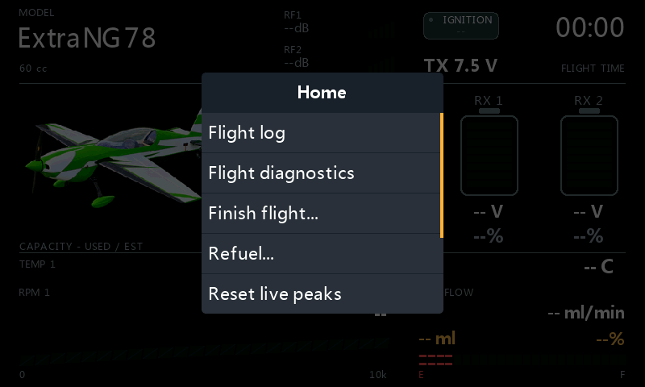 <b>Widget menu</b></td>
<td>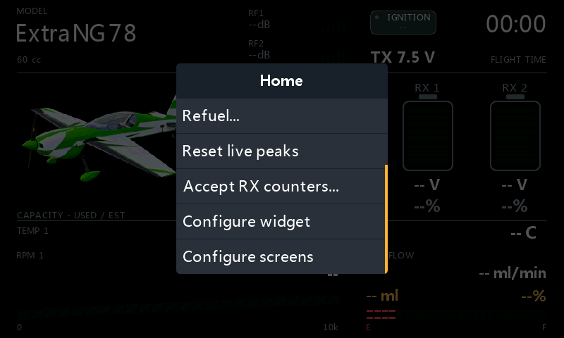 <b>Configure widget</b></td>
</tr>
</table>

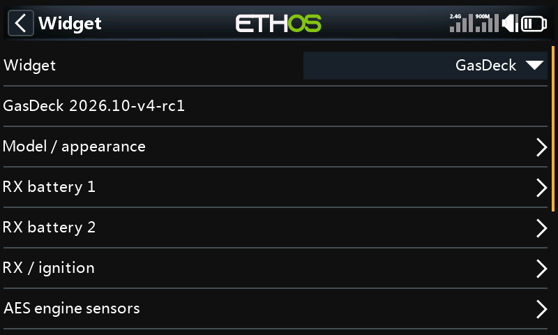

## 1. Model / appearance

Enter your engine's **Engine brand**, **Displacement** and **Engine count**.
For this single-engine example, use **Engine count = 1**.
Keep **Image source = Selected model** to use the active ETHOS model's picture.
Leave **Font file** blank for the radio's built-in fonts.

## 2. RX battery 1, then RX battery 2

Set **Chemistry** and **Cells** to match each actual battery.

| Field | RX battery 1 | RX battery 2 |
| --- | --- | --- |
| Remaining from | Voltage estimate | Voltage estimate |
| Voltage source | RxBatt1 — V | RxBatt2 — V |

This method estimates charge from voltage, chemistry and cell count; it is
approximate, especially with LiFe. The corresponding RX battery menu shows
**Remaining % is a voltage estimate.** The dashboard shows the percentage without
an EST label.
**Capacity**, **Consumed mAh** and **Percent source** are inactive for this method.
The combined **RxCurrent** belongs in the next section.

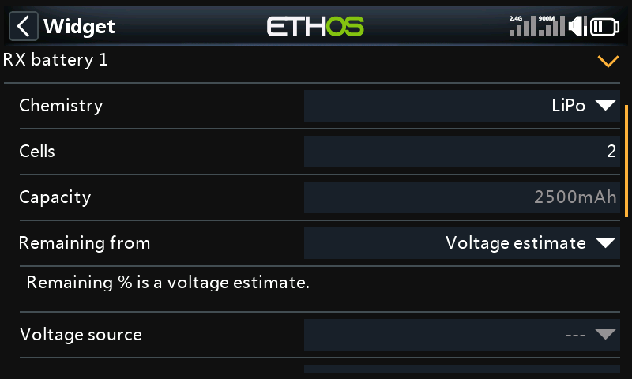

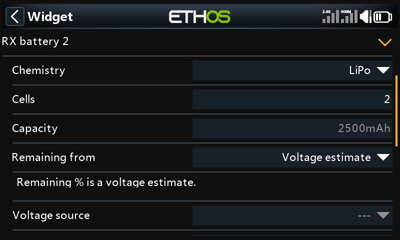

## 3. RX / ignition

| Field | Select |
| --- | --- |
| RX total current | RxCurrent — A |
| RX total consumed | Your calculated Consumption sensor, for example RxConsuption — mAh |
| Ignition status | Your ignition switch, channel or actual status source |
| Ignition ON above | Usually 0; verify that both ON and OFF display correctly |
| TX voltage | Your transmitter battery source, or leave blank for the built-in source |

**RxConsuption** is a user-created sensor name, not a separate factory measurement.
You can call it **RxConsumption** or another useful name. It shows combined RX
consumption and cannot tell how much came from each battery.

### If consumed mAh is missing

1. Open **Model > Telemetry**, discover **RxCurrent** and check that it reports **A**.
2. Choose **Create calculated sensor > Consumption**. If there is a **Sensors**
   tab, first open its **+** menu.
3. Set **Source = RxCurrent**, **Unit = mAh**, a suitable **Range** and a useful name.
4. Enable **Persistent** and leave the automatic **Reset** source unset.
5. After fully charging both packs covered by this counter, use **Reset** in the
   calculated sensor's edit screen.
6. Select that calculated sensor in GasDeck's **RX total consumed**.

Do not reset RX consumption on ignition changes or RF loss. Persistent retains the
reading across radio restarts; it cannot recover consumption while current data
was missing. See [ETHOS Consumption sensors](https://ethos-doc.frsky-rc.com/model-setup/telemetry/#consumption-sensor).

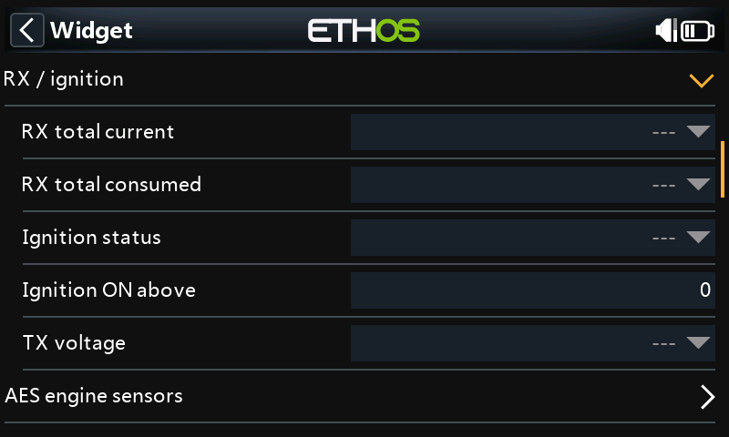

## 4. AES engine sensors

| Field | Select |
| --- | --- |
| RPM displays | 1 |
| Temp displays | 1 |
| RPM 1 source | AES RPM 1 — r/m (rpm), sometimes named AESRPM1 |
| Temp 1 source | AES temp. 5 — °C |
| Temperature unit | Celsius, or Fahrenheit if preferred |

**Temp 1** means the first display slot; it can show AES temperature input 5.
Choose the connected sensor that gives a plausible temperature.
Set **RPM scale max**, **RPM red zone**, **Temp warning** and **Temp critical** for
your engine. These display limits do not control the engine.

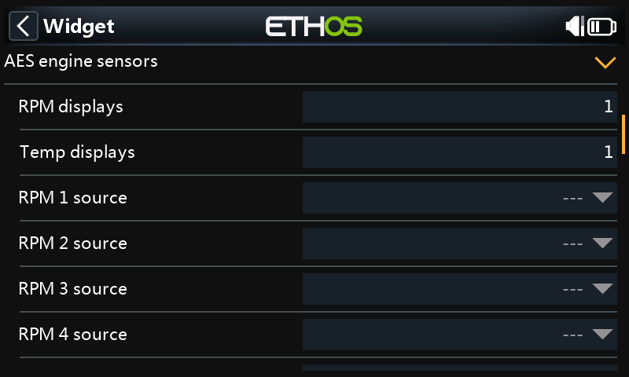

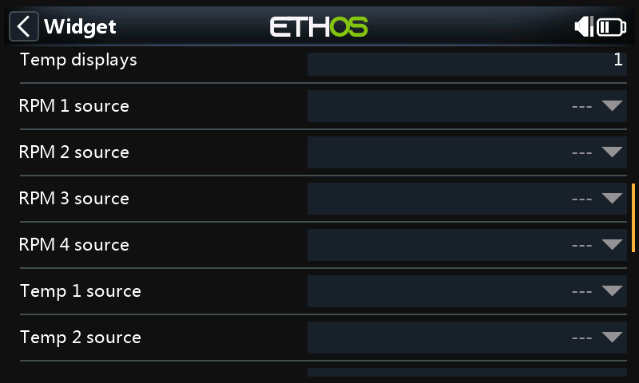

## 5. Fuel / flowmeter

| Field | Select or enter |
| --- | --- |
| Tank value from | Integrate flow |
| Tank capacity | Actual tank volume in ml |
| Refill amount | Fuel in the tank after filling; for full tank, use Tank capacity |
| Flow source | AES flow — ml/min |
| Flow input units | Auto when the sensor reports ml/min (ETHOS may label it ml/m) |
| Flow calibration | 100% initially; adjust after checking measured consumption |
| Reserve / warning | Your chosen reserve, for example 20% |

Use **AES flow**, the current flow rate. **AES avg. flow** and **AES max flow** are
different readings and should not drive integration.
**Fuel used source**, **Remaining source** and **Volume input units** are inactive
for **Integrate flow**.

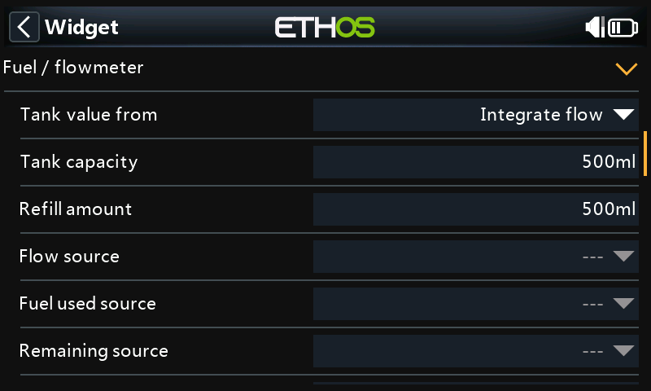

### Refuel and data gaps

Fill the tank, set **Refill amount**, then choose **Refuel... > Confirm** in the
widget menu or fuel settings. Exit **Synthetic preview** first.

Confirmation works immediately with the model switched off or ignition ON.
If the sensor is offline, the confirmation is registered even though the tank
meter stays unknown. Switch on the model: the estimate appears when the first
valid flow reading arrives. Consumption before that reading cannot be recovered.

Refuel is blocked while a counted flight is still running; the dialog explains why.
A paused flight is completed, keeping its count and qualified log.
Once flow measurement has started, an unobserved gap makes the estimate unknown
until another confirmed refill. Confirm an actual refill again after a radio/widget
restart. Refuel does not reset the AES or any telemetry sensor.

## 6. Alerts

Choose **Low fuel alert**, **Low RX alert** and the **Repeat interval** you want.
**Alert RX estimate** defaults Off; enable it deliberately for this voltage-based
battery setup. Fuel alerts use **Reserve / warning**; RX alerts use 30%.

For spoken alerts, select **Audio folder**, **Fuel WAV** and **RX battery WAV**.
No sounds are bundled. Missing or invalid files use a tone.

## 7. RF sources / limits

| Field | Example |
| --- | --- |
| RF displays | 2 |
| RF 1 source | RSSI 2.4G — dB |
| RF 1 profile | ACCESS / TD / TW |
| RF 2 source | RSSI 900M — dB |
| RF 2 profile | ACCESS / TD / TW |

Leave **Log RF 1 source / Log RF 2 source** blank to graph the selected RSSI sources.
Alternatively select **VFR 2.4G / VFR 900M** to graph valid-frame rate in **%**.
RSSI signal strength and VFR frame delivery are separate measurements.

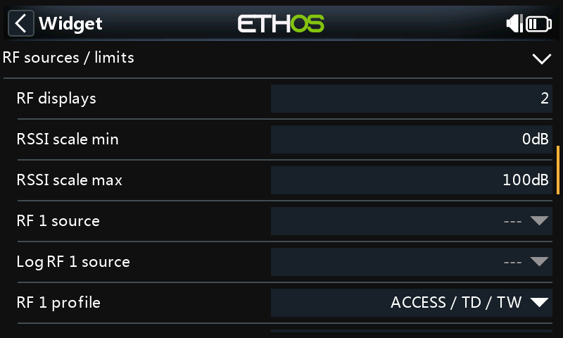

## 8. Flight session

Leave **Enable log** Off if you only want the dashboard.
To count flights, enable it and select **Throttle source**; the **Ignition status**
selected earlier is the flight gate. Check raw throttle endpoints in
**Flight diagnostics** before setting **Throttle low/high (raw)**.

Default qualification needs 60 seconds and at least 5 seconds above 50% normalized
throttle. Set **Airborne gate** only if you have a suitable source.
Blank **Power loss source** uses either valid positive RX voltage.
Ignition OFF pauses the same session; ON resumes it without counting twice.

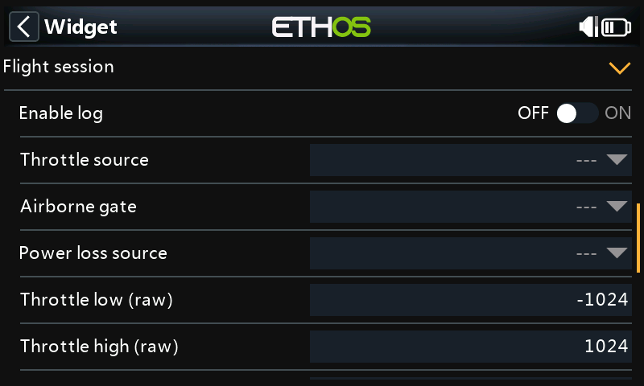

## 9. Preview and final check

Keep **Synthetic preview** Off for real telemetry.
With the model on, check both battery voltages, combined RX current/consumption,
RPM, temperature, live flow and RF readings. Confirm Refuel after filling and check
that the fuel amount matches **Refill amount** when a valid flow reading is available.

## Advanced reference

### Battery methods and sensor type

| Remaining from | Required value | How it is used |
| --- | --- | --- |
| Voltage estimate | Individual pack voltage in V; matching chemistry/cells | Approximate charge from voltage |
| Consumed mAh | Individual pack consumption in mAh; matching Capacity | Remaining capacity from that pack's consumption |
| Percent sensor | Individual remaining charge in % | Uses the supplied percentage |

**Voltage source** still displays pack voltage and supports flight power tracking.
A source's name does not change its type or units.

Do not halve combined **RxConsuption** or assign it to both batteries.
Individual consumed-mAh remaining charge stays unknown without its own measurement.
GasDeck does not calculate mAh from its current fields or add individual counters.

An ETHOS calculated **Percent** sensor can provide a normalized **%** source.
If it is derived from voltage, it is still a voltage estimate: verify its empty/full
mapping for the battery and do not treat it as measured capacity. GasDeck cannot
identify how a supplied % sensor was calculated. Editing a raw
voltage source's **Range** alone does not turn its value in V into a valid % reading.
See [ETHOS Percent sensors](https://ethos-doc.frsky-rc.com/model-setup/telemetry/#percent-sensor).

After an unexpected individual consumption-counter reset, check actual charge and
the mAh readings. Exit preview, confirm valid ignition OFF and choose
**Accept RX counters... > Confirm**. It accepts both readings without resetting
sensors, setting charge to 100%, changing the flight count or refuelling.
Missing or invalid readings remain unknown.

Battery colors: green >40%, yellow ≤40%, orange ≤35%, red ≤30%.
Unknown shows a neutral empty meter with **--%**. Voltage numbers are neutral.

### Other fuel methods and units

| Tank value from | Source/type | Settings used |
| --- | --- | --- |
| Capacity - consumed | Fuel used source — cumulative ml or L | Tank capacity, Refill amount, Volume input units; confirmed starting counter |
| Integrate flow | Flow source — ml/min, L/min or ml/s | Tank capacity, Refill amount, Flow input units, Flow calibration |
| Remaining volume | Remaining source — sensor-reported remaining ml or L | Tank capacity and Volume input units |
| Remaining percent | Remaining source — sensor-reported remaining % | Tank capacity converts % to displayed ml |

**Flow source / Flow input units** also drive the FLOW display in the other methods.
Flow rate, cumulative consumption and remaining volume are different sensor types.
Auto follows the reported unit; select the correct override if a source is mislabeled.
**Flow calibration** affects only integrated flow.

For **Capacity - consumed**, an offline Refuel is registered and waits for the first
valid counter reading as its new starting point. Earlier consumption cannot be
reconstructed. An unexpected counter decrease makes the estimate unknown.

**AES res. vol.** (ml) and **AES res. pect.** (%) can be selected for the corresponding
remaining method only after the tank capacity and refill/reset behavior are configured
on the AES/ETHOS side. Check those readings against an actual full tank before use.
GasDeck's Refuel does not update that external tank configuration or reset its readings.
Use the reset procedure supported by your AES firmware.
See the [FrSky AES II manual](https://www.flyingtech.co.uk/wp-content/uploads/2024/05/Advanced-Engine-Suite-II-Manual.pdf).

Check flowmeter calibration, fuel compatibility, mounting, air bubbles and range.
Tank reserve segments and the remaining amount at/below reserve are red;
normal fuel uses the accent color.

### Layout, image and alert options

RPM and temperature display counts are independent, from 0 to 4 each. More display
slots do not create sensors. RPM calibration belongs in the sensor/AES/ETHOS.
MAX is the observed peak. Temperature warning/critical values are entered in °C,
also when the displayed unit is Fahrenheit.

Background can follow **Radio theme**, be **Black** or use **Custom** colors.
A golden accent is the normal palette. Use an RGB/RGBA 8-bit PNG model image;
large dimensions consume more memory. See [image and font setup](GasDeck.md#model-image-and-fonts).

WAV files should be PCM, 32 kHz, mono, 16-bit. Repeat interval is 1–600 seconds;
alerts wait for the current sound to finish. Preview plays no alerts.

### RF profiles

| Profile | RSSI warning / critical | VFR early / low |
| --- | --- | --- |
| ACCESS / TD / TW | 35 / 32 dB | 95 / 50% |
| ACCST | 45 / 42 dB | 95 / 50% |
| Custom | Your dB limits | Your % limits |

RSSI scale defaults to 0–100 dB and sets the display range, not a radio alarm.
Unknown RF values are neutral. Choose only sources your receiver actually reports;
antenna count does not establish the number of readings. Keep native radio alerts.

### Flight completion, diagnostics and storage

**Finish flight... > Confirm** requires preview Off and valid ignition OFF.
It ends the session, retains the last qualified log and permits a new flight,
without changing fuel or the count. Use Refuel after actually filling the tank.

Power loss delay defaults to 10 seconds (3–120). One missing RX feed does not finish
the session while the other remains valid. Extended RF loss may resemble power loss.
Optional **Auto-open log** waits that delay plus **Extra log delay** (default 5 seconds);
returning power or manual view/settings changes cancel it. Manual Finish/Refuel does
not open the log automatically.

Only a qualified flight replaces the retained log. Flight time counts qualifying
intervals; RF history includes pauses. **Flight time from** can select an ETHOS timer.
Bench running can qualify; disable logging during bench work when appropriate.

**Flight diagnostics** shows throttle, ignition, airborne/power gates and the blocking
reason. **Reset live peaks** clears maxima without changing the count.
**Reset flight count** is per model; finish the session with valid OFF first.
The widget shows ignition status and never switches ignition or throttle.

Settings and count are saved per model; detailed logs and graphs clear on radio restart.
Back up the SD card and model together, and check sources if you copy a model.

### Troubleshooting

| Symptom | Check |
| --- | --- |
| Widget missing | scripts/GasDeck/main.lua, restart ETHOS and review Lua errors in Info |
| Empty RX meter | Selected method/source, chemistry/cells or Capacity, preview Off |
| Fuel unknown after offline Refuel | Confirmation is registered; switch on the model and wait for a valid selected fuel reading |
| Unknown fuel after a flow gap | Missing consumption cannot be recovered; confirm an actual refill |
| No counted flight | Enable log, ignition, throttle endpoints and qualification gates; diagnostics |
| Ignition OFF does not start another flight | Finish flight or Refuel between sorties |
| No image | Model path, RGB/RGBA 8-bit PNG and suitable dimensions; Suite Image Manager |

[Installation](GasDeck.md) | [Home](../README.md)
