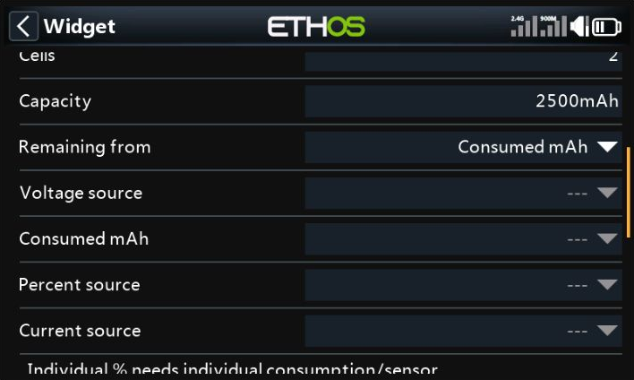
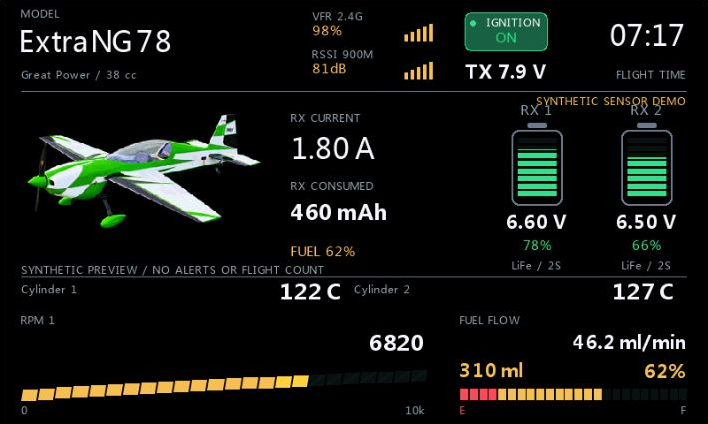
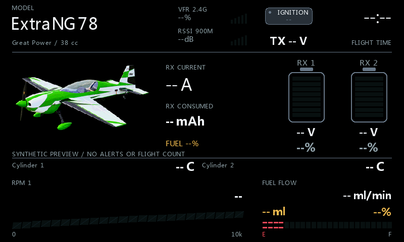
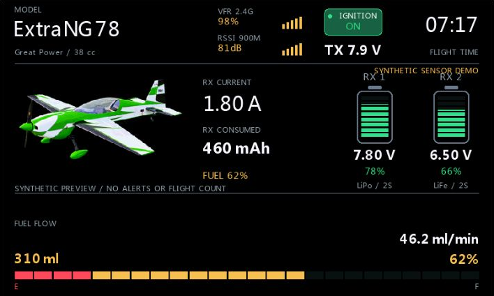
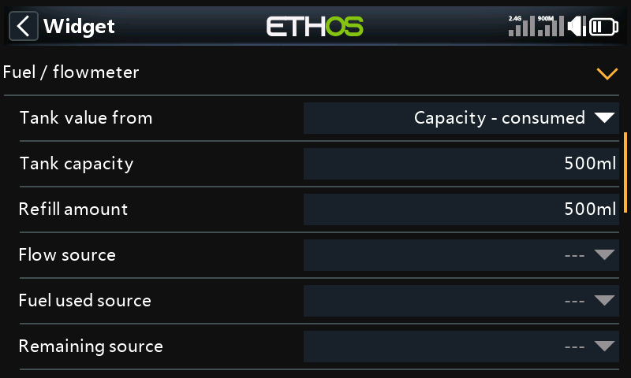
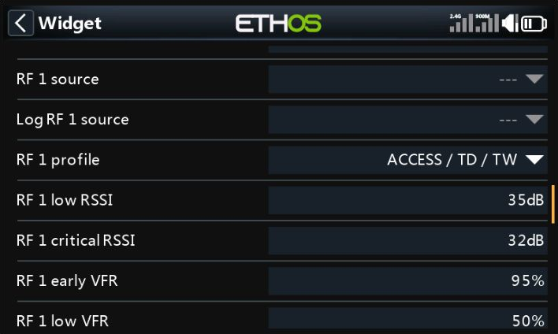
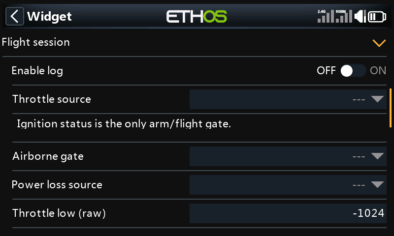
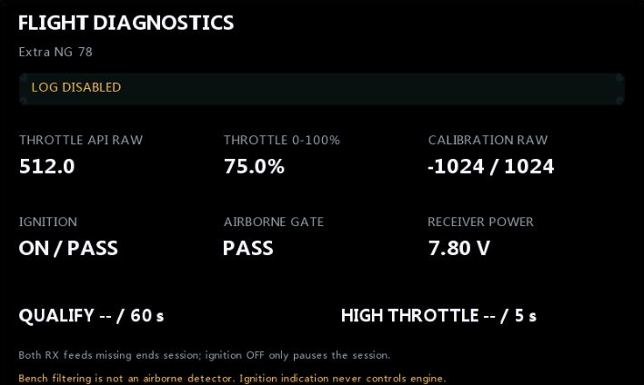

# GasDeck illustrated configuration guide

[Home](../README.md) | [Norsk](Konfigurasjon-norsk.md) | [Technical notes](GasDeck.md)

Readings, peaks, counters and histories in all examples are synthetic. The owner-approved
Extra NG 78 aircraft is an illustration. Four-engine/cylinder variants are hypothetical.

## 1. Model and appearance

Open **Configure widget > Model / appearance**. Name follows the active ETHOS model.
The owner's example uses **Engine brand = Great Power**, **Displacement = 38 cc**.
The neutral configuration line appears once, below the model name, aligned with VoltDeck.

| Field | Choices and purpose |
| --- | --- |
| Engine brand / Displacement | Display information; not a motor database or RPM calibration. |
| Engine count | 1-4; independent of visible RPM/temperature counts. |
| Background | Radio theme, Black or Custom. |
| Background color / Accent color | Custom palette; theme mode follows the radio. A golden normal accent is not a warning. |
| Font file | Optional ETHOS-supported font; native fonts are fallback. |
| Image source / Image file | Selected model, explicit file or Hidden. Reuse the same model path, not another copy. |

TX voltage is below the smaller ignition plaque. Flight-time size/position matches
VoltDeck. Engine description is not duplicated under the aircraft picture.

## 2. Configure each RX battery

**RX battery 1** and **RX battery 2** have independent chemistry, cells, capacity and
sources. Defaults: LiPo, 2S, 2500 mAh, Consumed mAh.

| Field | Meaning |
| --- | --- |
| Chemistry / Cells / Capacity | LiPo or LiFe, 1-8 cells, 100-20000 mAh; match the actual pack. |
| Remaining from | Consumed mAh, Percent sensor or explicit Voltage estimate. |
| Voltage source | Pack voltage, not regulated output when estimating pack capacity. |
| Consumed mAh / Percent source | Individual pack consumption or remaining percent. |
| Current source | Optional individual current; central total current is selected separately. |

Consumed-mAh remaining = clamp(100 x (capacity - consumed) / capacity, 0, 100).
2500 mAh capacity with 550 mAh consumed gives 78%. Establish/reset the consumption
counter after charging; GasDeck does not infer start charge or reset every sensor.

Do not use one combined counter for both packs: dual-feed current sharing can be uneven.
Select **RX total current / RX total consumed** under **RX / ignition** for the center fields.

Capacity colors: green >40%, yellow <=40%, orange <=35%, red <=30%. Unknown is
a neutral empty meter with --%, not full. Voltage numbers themselves are neutral.

### LiFe and EST

Prefer individual consumed mAh or measured percent. Explicit Voltage estimate shows
**EST** and is approximate, especially for LiFe's flat curve and voltage sag. Display
bounds: LiPo 4.20-3.30, LiFe 3.65-2.80 V/cell, not recommended discharge/alarm limits.
**Alert RX estimate** defaults Off; enable deliberately if estimates should trigger alerts.

## 3. Ignition and TX

**Ignition status** can be switch, logical source, channel or actual telemetry status.
**Ignition ON above** defaults to 0; ON requires a value strictly above the threshold.
Confirm both source states before using qualification.

- ON: green; allows flight qualification with the other gates.
- OFF: red; pauses the same session.
- Missing/invalid: neutral --; never treated as confirmed OFF.

A switch reports a command, not actual ignition power. Removing the CMD/SENSOR/DEMO
line does not change that distinction. GasDeck is read-only.
Refuel, Finish flight and counter reset require valid ignition OFF.
**TX voltage** selects a source or uses the available built-in transmitter battery source.

## 4. RPM and temperature layouts

**AES engine sensors** independently sets **RPM displays** and **Temp displays** to 0-4.
Select actual **RPM 1-4 source** and **Temp 1-4 source** values; extra slots do not create sensors.

| Example | RPM | Temperatures |
| --- | --- | --- |
| One engine / two monitored points | 1 | 2 |
| Multi-cylinder/components | 1 | 4 |
| Four engines | 4 | 4 |
| Fuel-only lower deck | 0 | 0 |

**RPM style**: Numeric or Retro LCD. **RPM scale max** defaults to 10000 rpm and
**RPM red zone** to 85%. These are display settings, not a rev limiter or engine-specific
safe RPM. Configure sensor/AES/ETHOS pulse/pole settings to report mechanical RPM;
there is no electric KV estimate. MAX is the observed session peak. Preview can overwrite
instantaneous readings without matching source peaks; gallery peaks are illustrative.

**Temperature unit**: Celsius/Fahrenheit. **Temp warning / Temp critical** default
150/180 degrees Celsius even with Fahrenheit display. Set appropriate manufacturer
and sensor-location limits; these are examples, not GP38 temperature recommendations.
Normal text below warning, yellow at warning, red at critical.

## 5. Fuel / flowmeter

Enter actual **Tank capacity** and **Refill amount**, defaults 500 ml each.
Default **Reserve / warning** is 20%, **Flow calibration** 100%.

| Tank value from | Sources | Calculation |
| --- | --- | --- |
| Capacity - consumed | Fuel used source | Loaded minus consumption since confirmed refill. |
| Integrate flow | Flow source | Trapezoidal integration; explicit Refuel required after restart. |
| Remaining volume | Remaining source | Direct sensor ml/L. |
| Remaining percent | Remaining source | Sensor percent; configured tank volume gives displayed ml. |

**Flow input units**: Auto, ml/min, L/min, ml/s. **Volume input units**: Auto, ml, L.
ETHOS ml/m means ml/min. Auto trusts unit metadata; override mislabeled sources.
Flow rate, cumulative consumption and remaining volume are different values.
Calibration applies only to integrated flow.

### Refuel and data gaps

With confirmed ignition OFF, Refuel establishes the actual Refill amount and a new
session. It does not physically fill a tank or reset unrelated sensors. Consumption
mode saves the source baseline; unexpected counter reset makes the estimate unknown,
not full. Before first confirmed refill its assumed baseline is zero: establish a real
baseline before use.

Flow integration never assumes full after radio/widget restart. Confirm a real refill.
Missing data/time gaps longer than 2 s invalidate the estimate until another actual
confirmed refill. Missing consumption cannot be reconstructed.
Direct remaining sensors are not overwritten by Refuel. Check hardware calibration,
fuel compatibility, mounting, air bubbles and measurement range independently.

Tank reserve segments are red. At/below the selected reserve, remaining amount is red;
normal fuel uses the accent, not battery thresholds.

## 6. Alerts

**Low fuel alert / Low RX alert** default On; **Alert RX estimate** defaults Off.
Select **Audio folder**, **Fuel WAV** and **RX battery WAV** individually.
**Repeat interval**: default 15 s, range 1-600 s. Suitable PCM WAV: 32 kHz, mono, 16-bit.
Missing/invalid files fall back to a tone. Shared playback timing avoids overlap.
Fuel uses reserve, RX uses <=30%. Synthetic preview never plays alerts. No sounds are bundled.

## 7. RF sources / limits

Choose 1-3 **RF displays** and actual sources. Labels follow ETHOS, e.g. RSSI 2.4G
or VFR 900M; dB/% is retained without a reading. **Log RF 1-3 source** may differ
from the main view; blank reuses that dashboard slot.

| Profile | RSSI warning / critical | VFR early / low |
| --- | --- | --- |
| ACCESS / TD / TW | 35 / 32 dB | 95 / 50% |
| ACCST | 45 / 42 dB | 95 / 50% |
| Custom | Each slot's configured dB limits | Each slot's configured percent limits |

**RSSI scale min/max** controls display range, default 0-100 dB, not radio alarms.
Normal is accent, warning yellow, critical red, unknown neutral.
VFR reflects valid-frame delivery, RSSI signal strength. VFR can reveal delivery drops
clearly; RSSI still helps show link margin. 95% is an early visual marker, not a universal
manufacturer alarm. Match receiver documentation and keep native alerts.

TD SR18 has two 2.4 GHz antennas and one 900 MHz antenna, not necessarily three reported
RF values. Some firmware combines VFR. Never invent a third source because of antenna count.

## 8. Flight session

Logging defaults Off. Select **Throttle source** and **Ignition status**; no separate ARM.

| Field | Default / meaning |
| --- | --- |
| Flight minimum | 60 s accumulated qualifying time; range 60-3600 s. |
| Throttle gate / High throttle time | >=50% normalized throttle for >=5 s, configurable. |
| Throttle low/high (raw) | -1024/+1024 API values, not the screen's -100/+100%; reversed endpoints supported. |
| Airborne gate | Optional; blank and Always on pass. Not an airborne detector. |
| Power loss source | Override; otherwise either positive valid RX voltage keeps power alive. |
| Power loss delay | 10 s sustained loss; 3-120 s. |
| Auto-open log / Extra log delay | Off / 5 s; opens once after qualified power-loss completion. |
| Flight time from / ETHOS timer | GasDeck qualifying session time or selected native timer. |

Ignition OFF/unknown pauses but retains statistics/history. ON resumes without recounting.
One absent RX feed does not end a dual-feed session. Extended RF loss may imitate power loss.
With batteries retained between sorties, use **Finish flight** or real **Refuel**, ignition OFF.

Last qualified log survives model shutdown and next unqualified candidate. Only the next
qualified flight replaces it. RF history includes pauses; flight time only qualifying
intervals. Bench running can qualify: gates are filters, not proof of flight.

Auto-open waits Power loss delay plus Extra log delay. Returning power or manual
view/settings changes cancel it. Enabling later does not replay old logs.
Manual Finish/Refuel is not the power-loss auto-open trigger.

## 9. Diagnostics, menu and preview

**Flight diagnostics** shows raw/normalized throttle, ignition, airborne gate, power
and qualifying time. Follow the blocking reason; LOG DISABLED is not an error.
**Reset live peaks** clears current maxima, not the counter. **Memory snapshot**
reports available environment memory, not isolated widget allocation.
**Reset flight count** is per model; finish the active session with confirmed OFF first.

**Synthetic preview** shows fabricated readings without counting flights or playing
alerts. Turn it Off for live testing. Synthetic gallery history is not flight evidence.

## 10. Storage and troubleshooting

Settings: up to two alternating checksum-protected gc1*.cfg slots per model.
Counter: up to two gd*.dat slots. Slots are created on first write, not per flight.
ETHOS stores source assignments. Detailed logs/graphs do not survive radio restart.

| Symptom | Check |
| --- | --- |
| Widget missing | scripts/GasDeck/main.lua, restart, Info errors, stale generated bytecode. |
| Empty RX meters | Individual method/source/capacity, Preview Off. |
| Unknown fuel after data gap | Missing flow cannot be reconstructed; confirm a real refill. |
| No counted flight | Logging, ignition, normalized throttle, power/time gates; diagnostics. |
| OFF does not create another flight | Intentional; Finish flight / Refuel between sorties. |
| No image | Correct model path, RGB/RGBA 8-bit PNG and suitable dimensions; Suite Image Manager. |

[Technical notes](GasDeck.md) | [Home](../README.md)

## Safety hardening (October 2026)

The owner confirmed physical X20RS radio testing of the final RC1 builds on 2026-10-05. The shared final check passed 252 named automated checks; the preceding native ETHOS 26.1.2 simulator run passed 84 functional cases and 120 production-rendered frames. Counts cover both widgets, not 252 cases per widget. This is a project test report, not universal hardware compatibility or safety certification.

- Remaining capacity from consumed mAh requires a monotonic counter. An unexpected decrease larger than 0.1% of configured capacity (minimum 1 mAh) makes remaining charge unknown; it never silently shows a full pack.
- A configured battery-voltage source must be absent for the configured session-end delay before reconnection permits a new counter baseline. A brief RF gap, ARM/ignition pause, missing consumption sample, or entering preview does not clear the guard. A long RF outage can still resemble a battery change; this is not a physical battery detector.
- After checking actual charge and the mAh reading, use the widget menu **Accept battery counter...** (VoltDeck) or **Accept RX counters...** (GasDeck). Confirmation requires a valid ARM OFF / ignition OFF indication, respectively. This only accepts the current reading; it does not reset any radio sensor, change charge, or affect flight counting. GasDeck fuel refuelling is independent.
- Percent sources must use the percent unit. Explicit raw sources with UNIT_NONE and a percent unit label are also accepted. Voltage/current values are never interpreted as percentages.
- Audio cooldown persists across short recovery, missing samples and configuration edits. WAV duration limits repetition to avoid overlap. GasDeck gives RX the first simultaneous alarm slot, then alternates due RX/fuel alarms so neither is starved.
- Synthetic preview does not change live peaks, consumption guards or fuel integration. Actual flow integration becomes unknown after an unobserved gap; refuel confirmation is then required.
- Long labels are UTF-8-safe shortened. Native-font text measurements use a 64-entry bounded cache; source names refresh every five seconds or on source/config changes, while canonical units stay live.

### Settings compatibility

This major version deliberately has no legacy settings migration. New per-model scalar files use /scripts/vc3*.cfg (VoltDeck) and /scripts/gc1*.cfg (GasDeck); old vc*/gc* files are not read, modified or deleted. Configure the new defaults explicitly. Counter files and the current ordered ETHOS source layout are unchanged, so current selected sources and flight counts can be retained without importing old scalar settings. New scalar envelopes are VD5 / GD2, explicit schema 1; native source headers remain VD4 / GD1. Invalid or future schemas are not overwritten. Keep backups before upgrading and verify all capacity, chemistry, scale, alarm and session settings on the radio. Reserved GasDeck ARM is not migrated to ignition. No test helpers or model-specific settings are included in the widget package.
